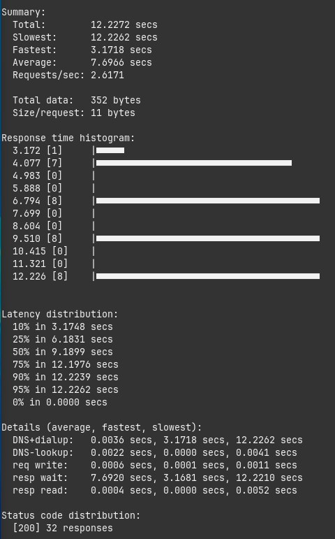
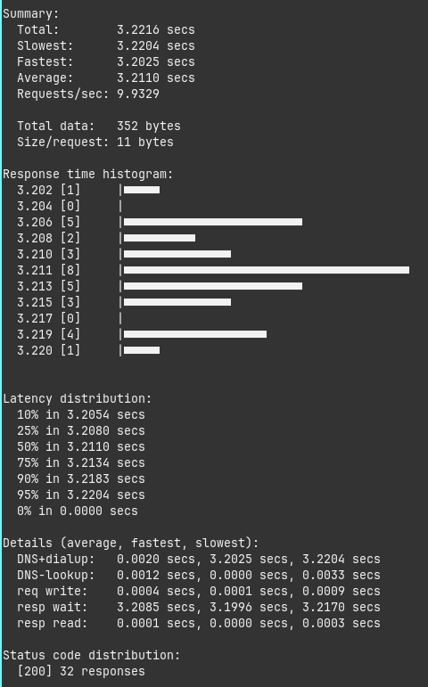

# **Threads vs Virtual Threads**

No contexto dos sistemas operacionais, threads são recursos fundamentais que permitem a execução simultânea de diversas tarefas. Em Java, uma thread é representada pela classe `java.lang.Thread`. Quando uma thread é utilizada, o Java solicita ao sistema operacional uma thread do sistema para realizar essa execução. No entanto, threads são recursos que consomem CPU, memória e disco da máquina, tornando-se, portanto, um elemento bastante custoso. Além disso, o sistema é intrinsecamente limitado pela capacidade de hardware da máquina onde está sendo executado.

Com a introdução das threads virtuais, a responsabilidade de gerenciamento dessas threads passa do sistema operacional para a Máquina Virtual Java (JVM). Dessa forma, o Java utiliza um número reduzido de threads do sistema operacional, gerenciando de maneira mais eficiente os recursos de CPU, memória e disco. Isso torna as threads menos "caras" em termos de recursos do sistema operacional. Com esse novo modelo de gerenciamento, o software deixa de ser limitado pelas restrições do hardware da máquina, permitindo uma utilização mais eficiente e escalável dos recursos disponíveis.

fonte: [Conheça o poder das Virtual Threads com Java e Spring Boot](https://www.youtube.com/watch?v=a8gMokxIt4Q&list=WL&index=1)

## Exemplos do uso das Virtuais Threads

O comando `hey -n 32 -c 32 http://localhost:8080/demo` realiza um teste de carga na URL http://localhost:8080/demo. Ele envia 32 requisições (-n 32) ao servidor, sendo que todas as 32 são enviadas simultaneamente (-c 32). O objetivo é avaliar o desempenho do servidor sob carga.

**Resultado sem usar as virtuais threads**

**Resultado usando as virtuais threads**

